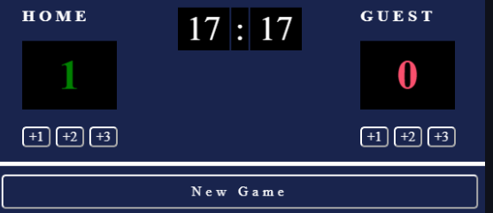

## Table of contents

- [Overview](#overview)
  - [Description](#description)
- [Projects](#projects)
  - [1-Passenger Counter App](#passenger-counter)
  - [2-Calculator App](#calculator)
  - [3-Solo Project:Basketball Scoreboard](#solo-project-basketball-scoreboard)
  
  ## Overview
  ### Description
  I completed 3 projects of Module 3 of the frontend developer career path on [Scrimba](https://scrimba.com/learn/frontend/solo-project-basketball-scoreboard-cz9adVfP). I mastered HTML/CSS and JavaScript in these projects. 
  You can see the visual representations of the each app below.
  
  ## Projects
  ### 1-Passenger Counter App
  ### Visulation of the App 

    
    
  ### 2-Calculator App
  ### Visulation of the App 

    
    
  ### 3-Solo Project:Basketball Scoreboard
  ### Visulation of the App 

    
 
