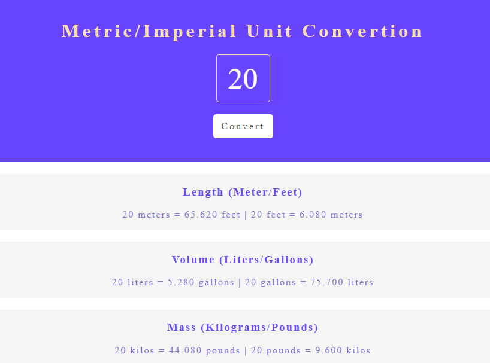
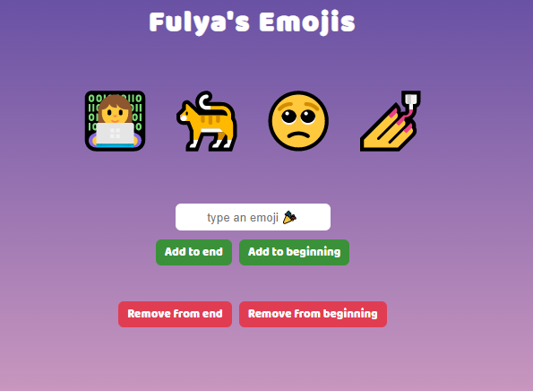

## Table of contents

- [Overview](#overview)
  - [Description](#description)
- [Projects](#projects)
  - [1-Passenger Counter App](#passenger-counter)
  - [2-Calculator App](#calculator)
  - [3-Black Jack App](#black-jack)
  - [4-Emoji Fighter App](#figter)
  - [5-Solo Project: Basketball Scoreboard](#solo-project-basketball-scoreboard)
  - [6-Solo Project: Password Generator](#solo-project-password-generator)
  - [7-Solo Project: Chrome Extension App](#chrome-extension)
  - [8-Solo Project:  Unit Converter App](#unit-converter)
  - [9-Solo Project:  My Emojis App](#my-emojis)
  
  ## Overview
  ### Description
  I completed 9 projects of Module 3 of the frontend developer career path on [Scrimba](https://scrimba.com/learn/frontend/). I mastered HTML/CSS and JavaScript in these projects. 
  You can see the visual representations of the each app below.
  
  ## Projects
  ### 1-Passenger Counter App
  ### Visulation of the App 

    
    
  ### 2-Calculator App
  ### Visulation of the App 

    
    
    
  ### 3-Black Jack App
  ### Visulation of the App 

    
    
  ### 4-Emoji Fighter App
  ### Visulation of the App 

    
    
  ### 5-Solo Project:Basketball Scoreboard
  ### Visulation of the App 
  ### Check it out: [The Link](https://basketball-scoreboard-challenge.netlify.app/)

    
    

 
  ### What I Learned?
  ```bash
  - Mastered JavaScript.
  - HTML/CSS
  - Functions
  - DOM Manipulation
  
  ```


  ### Stretch Goals: COMPLETED ✅

  - Add a new game button: Button added as a new div, when button is clicked all scores adjusted as zero
  - Highlight the leader: The text color changes when home or guest score is increased
  - Add a new content: Added time content
  - Change the design: Button styles, text weight, letter spacing adjusted
  - Make all six buttons work: Home or guest have 3 three buttons which increase score as 1,2 or 3
  
  
  ### 6-Solo Project: Password Generator App
  ### Visulation of the App 
  ### Check it out: [The Link](https://password-generator-solo-app.netlify.app/)

    
    

 
  ### What I Learned?
  ```bash
  - Mastered JavaScript.
  - HTML/CSS
  - For Loops
  - Arrays
  - Functions
  - Math.random() Module
  
  ```


  ### Stretch Goals: COMPLETED ✅

  - Generate two random passwords when the user clicks the button ✅
  - Each password should be 15 characters long ✅

 
  ### 7-Solo Project: Chrome Extension App
  ### Visulation of the App 

    
    

 
  ### What I Learned?
  ```bash
  - const,let
  - addEventListener(click and dblclick events)
  - innerHTML
  - function parameters,arguments
  - template strings
  - localStorage(setItem,getItem,clear)
  - Chrome API to save tabs
  - JSON object
  - manifest.json file
  - objects in array
  
  ```

  ### Stretch Goals: COMPLETED ✅

  - When user enter a link in textbox and clicks "SAVE INPUT" button, link is saved in storage ✅
  - When user clicks "SAVE TAB" button, current tab's url is saved ✅
  - When user clicks "DELETE ALL" button, all saved links are deleted on localStorage ✅
  
  
  
  ### 8-Solo Project: Unit Converter
  ### Visulation of the App 
  ### Check it out: [Link](https://scrimba-unit-converter-app.netlify.app/)

    
    

 
  ### What I Learned?
  ```bash
  - const,let
  - addEventListener event like click listener
  - innerHTML
  - functions
  - template strings
  - toFixed() attribute
  ```

  ### Stretch Goals: COMPLETED ✅

  - When user enter a number and press "CONVERT" button, generated all conversions(Meter/Feet, Liters/Gallons, Kilos/Pounds) ✅
  - Rebuild the desing spec ✅
  - Round numbers down to three decimal places ✅
  
  
  ### 9-Solo Project: My Emojis
  ### Visulation of the App 
  ### Check it out: [Link](https://scrimba-my-emojis-app.netlify.app/)

    
    

  ### What I Learned?
  ```bash
  - const,let
  - addEventListener event like click listener
  - for loops
  - innerHTML
  - functions
  - createElement,pop(),push(),shift(),unshift()
  - arrays
  - DOM manipulation
  ```

  ### Stretch Goals: COMPLETED ✅

  - Add your personal emojis: "👩‍💻", "🐈", "🥺","💅" added in array ✅
  - When user texts an emoji and clicks "Add to end", emoji added as last element ✅
  - When user texts an emoji and clicks "Add to beginning", emoji added as first element ✅
  - When user texts an emoji and clicks "Remove from end", emoji removed from last index ✅
  - When user texts an emoji and clicks "Remove from beginnig", emoji removed from first index ✅


  ### 10-Cat PWA App
  ### Visulation of the App 
  ### Check it out: [The Link](https://cat-pwa-app.netlify.app/)

    
    
  ### What I Learned?
  ```bash
  - Firebase: onValue, push(), remove(), getDatabase, ref(), snapshots
  - Favicon converter
  - Web Application Manifest
  - user-select
  - Object.values(), Object.keys()
  ```


